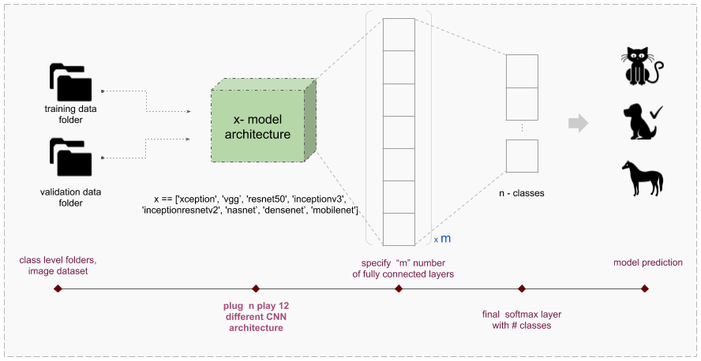

# CNN classification hub

This project contains 13 different SOTA ready to train CNN architecture's for **image classification**.



## How to use CNN classification hub

`CNN classification hub` has three major pre-built model training phases:

- Model architecture creation
- Model training on specified architecture
- Analyzing best weights from all the saved weights

Aim is to ease the efforts in training different model architecture for image classification tasks. 

**Steps**
1. Create an conda environment and install all dependencies using "requirement.txt"/"requirement-gpu.txt".


2. Create train and test/validation folder. Both the folder should contains images present in separate folder as per each category name.

    **training-validation/test data class-level image folder structure**
    ```
    dataset
    ├── train
    │   ├── class_1
    │   |    ├── <images for class_1>
    │   ├── class_2
    │   |    ├── <images for class_2>
    │   ├── class_3
    │   |    ├── <images for class_3>
    |   |   
    │   test
    │   ├── class_1
    │   |    ├── <images for class_1>
    │   ├── class_2
    │   |    ├── <images for class_2>
    │   ├── class_3
    │   |    ├── <images for class_3>
    ```

3. Make the changes to default parameters in "config.py" or run the below command. "config.py" file contains all the model training parameters pre-set for training like model_name_to_train, number of epochs, batch-size etc.

    ``` 
    python run_training.py -dtrain <path to train dir> -dvalid <path to test/validation dir> -m vgg16 -w "imagenet" -tt train_all 
    ```

other model names:
**'xception', 'vgg16', 'vgg19', 'resnet50', 'inceptionv3', 'inceptionresnetv2', 'nasnet_small', 'nasnet_large', 'densenet121', 'densenet169', 'densenet201', 'mobilenet', 'squeezenet'**


Note:
- Validation/test dataset is **must** for model training with the hub.
- Names of category folder in both train and validation/test folder should be exactly same.
- Names of the category folder will be used as tag for that particular class.
- There should not be any extra/folder present in training/validation folder(remove hidden folders too).
- Description about every dynamic parameter is briefed in "config.py".
- Edit the default parameters in "config.py" or pass them as run-time arguments as above.

(refer "config.py" for further details on more parameters)


## Expected results

Folder named "model_repository" will be created at the location specified (default current folder). Folder structure is mentioned below. 
 
```
model_repository
├── <model name>
│   ├── model_logs
│   |    ├── <weight for each epoch>
│   |    ├── <evaluation csv for each weight>
│   ├── tensor_logs
│   |    ├── <tensor board files>
│   │   training.log
│   │   <model name>_stats.png
│   │   index_class_mapping.json
```
+ A folder with specified model name will be created to store all the model training data.
+ "model_logs" folder keeps all the saved weight after every model training epoch. This folder also has a csv w.r.t to each weight. This is the evaluation csv containing prediction on validation dataset using the corresponding weights. 
+ "tensor_logs" folde keeps all the tensorboard logs.
+ "training.log" file has all the model training statistics for each trained epoch.
+ "< model name >_stats.png" is the graph dislaying model training statistics (both training and testing/validation)
+ "index_class_mapping.json" is a dictionary containing index to label mapping for each category trained. 

**Available models**
```
├── ResNet50
├── Xception
├── VGG16
├── VGG19
├── Inceptionv3
├── InceptionResNetv2
├── NasNetLarge
├── NasNetSmall
├── MobileNet
├── Densenet121
├── Densenet169
├── Densenet201
└── SqueezeNet

More architectures coming soon...
```

## Understanding the workflow

As mentioned earlier the entire workflow has three major phases

**Model architecture creation**

The first step of the pipeline is model architecture creation. Model architecture is created as specified by user in "config.py" (MODEL_NAME). After the model architecture, "m" (length of nodes list) number of fully connected layers are added at the top of model. Finally a softmax layer is stacked with "n_classes" number of ouput nodes. All the default parameters are mentioned in "config.py", change default values as required.  

**Model training on specified architecture**

In this phase model compilation is defined. Which include loss function selection, optimizers, callbacks etc (change default values as required). Then as per image-data folder, training and validation generators are created with data augmentation with training data. And then model training is started.
 
**Analyzing best weights from all the saved weights**

In this final phase of the analysis all the weights are analysed against validation/test dataset. Corresponding prediction data is saved in the same folder with the weights. Precision and Recall w.r.t to confidence threshold (change default values as required) are also calculated. 

Note: This post training validation is relevant because the validation accuracy reported during model training is usually calculated with batch normalization. Hence the practical accuracy on image level prediction differs from the validation accuracy calculated during model training. 

## Support

Feel free to open an issue on or send along a pull request.
If you like the work, show your appreciation by "FORK", "STAR", or "SHARE".

[](https://github.com/Sanjyot22/CNN-classification-hub)
*Author: [Sanjyot Zade](http://www.sanjyot.info/)*
